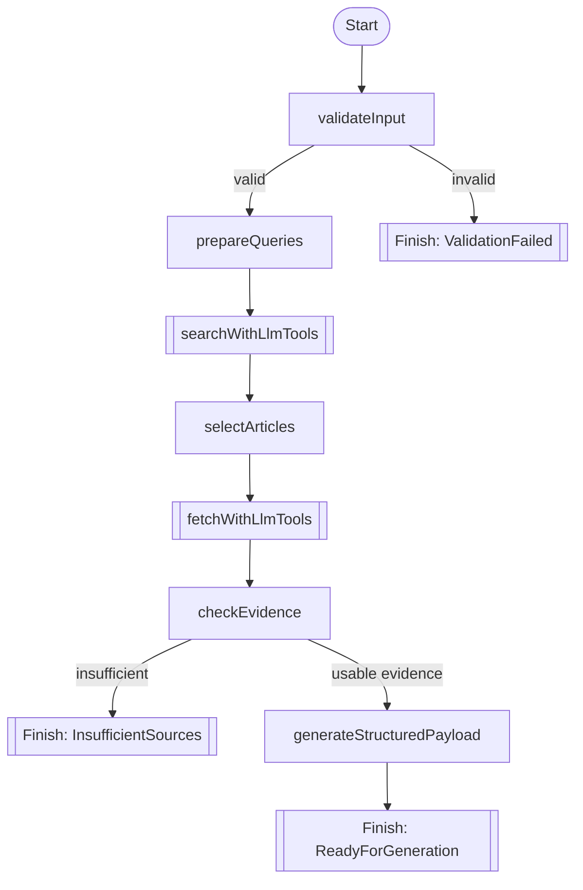

# LLM Tool-Calling Refactor Plan

## Purpose

This document defines the planned refactor from the current deterministic research workflow to a Koog workflow that demonstrates real LLM-driven tool use while preserving the app's quality bar.

The goal is not to make the whole app a free-form agent.

The goal is to show:

* Koog strategy graphs
* Koog tool calling
* stage-scoped tool access
* deterministic guardrails around an LLM-enabled workflow

## Current state

Today, the app uses:

* deterministic Kotlin validation
* deterministic Kotlin topic normalization
* deterministic Kotlin Wikipedia tool execution
* deterministic Kotlin article selection and evidence checks
* one LLM step for final structured study-and-quiz payload generation

This is stable, but it does not showcase Koog's tool-calling capabilities strongly enough for the workshop.

## Desired state

The next agent architecture should let the LLM call tools in clearly bounded stages:

* search stage: the LLM calls search tool(s)
* fetch stage: the LLM calls fetch tool(s)
* final generation stage: the LLM generates structured output from retrieved evidence

At the same time, the following should remain deterministic Kotlin logic:

* input validation
* topic normalization
* article selection
* evidence sufficiency
* final payload sanitization

## Why this design

This plan balances two goals:

1. show that Koog makes tool-enabled agents straightforward to build
2. avoid turning the workflow into an uncontrolled global tool loop

For a workshop app, that tradeoff is better than either extreme:

* fully deterministic tool calls do not showcase Koog enough
* fully open-ended ReAct across all tools is harder to reason about and harder to review

## Recommended Koog pattern

This refactor should use explicit strategy/subgraph nodes instead of hiding everything behind a monolithic agent loop.

Recommended Koog building blocks:

* `subgraph(..., tools = ...)`
* `nodeLLMRequest` or `nodeLLMSendMessageOnlyCallingTools`
* `nodeExecuteTool`
* `nodeLLMSendToolResult`
* `nodeLLMRequestStructured` or the existing structured-generation wrapper for the final payload step

This recommendation is based on the local Koog docs:

* `koog-docs/docs/nodes-and-components.md`
* `koog-docs/docs/custom-strategy-graphs.md`
* `koog-docs/docs/custom-subgraphs.md`

## Planned graph shape

## Stage design

### 1. `validateInput`

Keep as pure Kotlin.

No LLM involvement.

### 2. `prepareQueries`

Keep as pure Kotlin.

No LLM involvement.

### 3. `searchWithLlmTools`

Use a subgraph with a tool allowlist containing only search tool(s).

Recommended stage behavior:

* the LLM receives the prepared topics
* it is instructed to call the search tool to gather candidates
* tool execution is handled by Koog tool nodes
* the stage ends only after the expected search results are obtained or the stage fails safely

Important constraint:

* the search stage must not have article-fetch tools

### 4. `selectArticles`

Keep deterministic.

This stage should still apply Kotlin policy such as:

* exact-title preference
* non-disambiguation preference
* candidate caps
* deduplication

The point is to let the model retrieve, not to let it rewrite ranking policy.

### 5. `fetchWithLlmTools`

Use a subgraph with a tool allowlist containing only article-fetch tool(s).

Recommended stage behavior:

* the LLM receives the selected article titles
* it is instructed to call fetch tools for those articles
* tool execution is handled by Koog tool nodes
* the resulting fetched content is converted back into workflow state

Important constraint:

* the fetch stage must not have search tools

### 6. `checkEvidence`

Keep deterministic Kotlin logic.

The model should not decide whether weak evidence is acceptable.

### 7. `generateStructuredPayload`

Keep as an LLM stage.

This step already uses the model well:

* evidence is already grounded
* output must match a schema
* the UI needs structured summaries and quiz content

Important constraint:

* this stage must not have Wikipedia retrieval tools

## Guardrails

These rules should remain true after the refactor:

* the model never has unrestricted access to all tools for the whole workflow
* search and fetch stages have different tool allowlists
* deterministic policy code still owns ranking and evidence sufficiency
* the final generation stage cannot go back to retrieval tools
* `specificInstructions` remain low-priority customization only

## Testing expectations

The refactor is not complete without tests that prove:

* the search stage routes tool calls to the search tool node
* the fetch stage routes tool calls to the fetch tool node
* invalid input still exits before any LLM/tool stage runs
* search tools are not available in the fetch stage
* fetch tools are not available in the search stage
* retrieval tools are not available in the final payload-generation stage

## Recommended implementation order

1. refactor search stage first
2. keep selection deterministic
3. refactor fetch stage second
4. keep evidence deterministic
5. re-run payload generation on top of the refactored research snapshot
6. extend graph and integration tests

## Non-goals

This refactor should not introduce:

* broad web search
* MCP
* unrestricted global ReAct
* multiple quiz types
* server mode
* multi-agent orchestration
