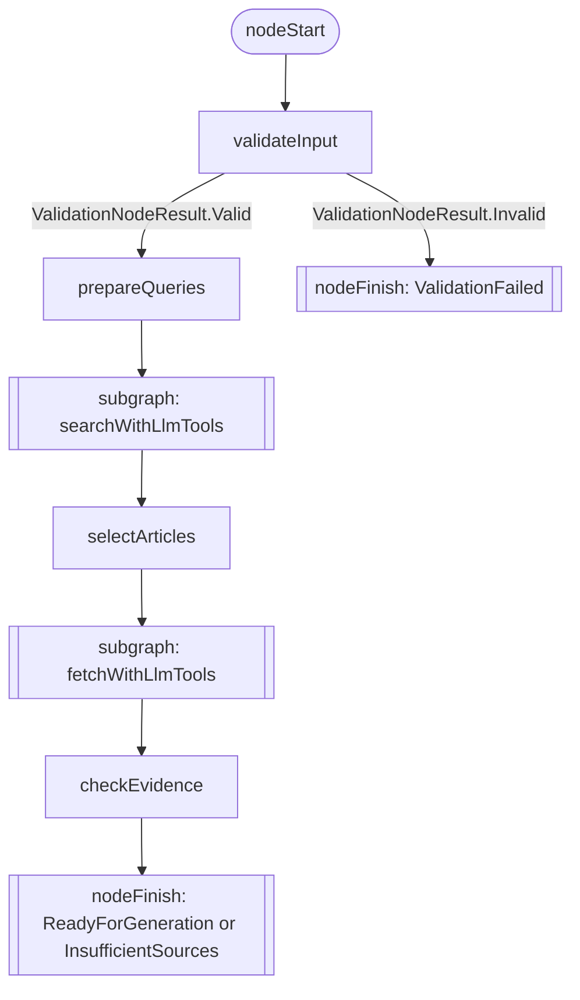
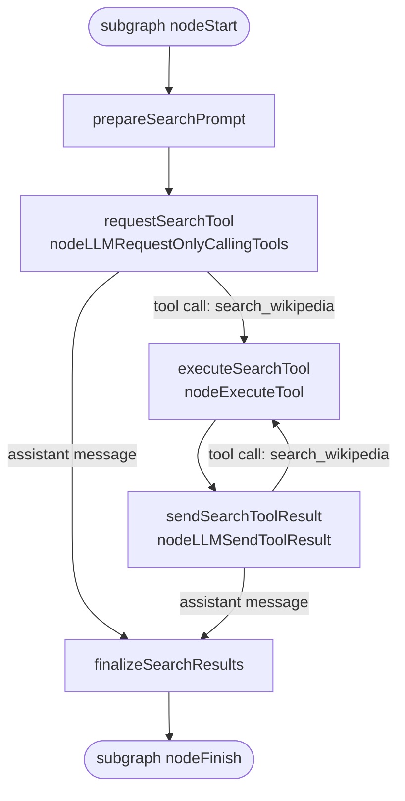
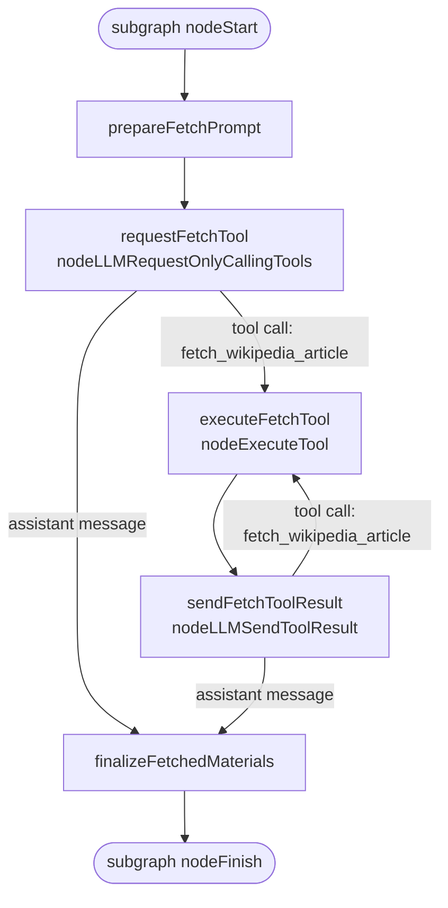

# Study Research Workflow

This document describes the actual Koog strategy graph implemented in [StudyResearchWorkflow.kt](../shared/src/commonMain/kotlin/org/jetbrains/koog/cyberwave/agent/workflow/StudyResearchWorkflow.kt).

This workflow is not a loose “agent decides everything” loop. It is a bounded research-first graph with two kinds of stages:

* deterministic Kotlin stages
* stage-scoped LLM tool-calling subgraphs

The graph finishes with a `StudyResearchWorkflowResult`, not with the final lesson screen. The structured lesson and quiz payload are generated later, after this workflow has already produced either:

* `ReadyForGeneration`
* `InsufficientSources`
* `ValidationFailed`

## Top-level graph

This is the real top-level shape of the strategy:

## Expanded search subgraph

The `searchWithLlmTools` subgraph is the first place where the LLM takes action.

It is configured with exactly one visible tool:

* `search_wikipedia`

The internal graph is:

### What `prepareSearchPrompt` does

It builds a strict prompt that tells the model:

* use `search_wikipedia` exactly once per topic
* pass the topic text verbatim
* keep the limit fixed to `WikipediaResearchPolicy.SEARCH_RESULTS_TO_CONSIDER`
* finish with exactly `SEARCH_STAGE_COMPLETE`

It also embeds the validated request as JSON inside the prompt using:

* `SEARCH_STAGE_REQUEST_PREFIX`

### What `requestSearchTool` does

This is a Koog `nodeLLMRequestOnlyCallingTools` node. Technically, this is where Koog sends the prompt plus tool schema to the model and asks for the next step.

The model can only do one of two things:

* emit a tool call for `search_wikipedia`
* emit an assistant message

In this stage, an assistant message is only valid if it is the exact completion marker:

* `SEARCH_STAGE_COMPLETE`

### What `executeSearchTool` does

This is a Koog `nodeExecuteTool` node. It does not ask the model anything. It:

* deserializes the tool arguments
* runs the real Kotlin implementation in [WikipediaTools.kt](../shared/src/commonMain/kotlin/org/jetbrains/koog/cyberwave/agent/tool/WikipediaTools.kt)
* captures the result as a tool-result message

### What `sendSearchToolResult` does

This is a Koog `nodeLLMSendToolResult` node. It appends the tool result to the conversation and asks the model what to do next.

That creates the bounded loop:

* tool call
* tool execution
* tool result back to the model
* next tool call or stage completion

### What `finalizeSearchResults` does

This node turns the subgraph back into deterministic state.

It:

* requires the assistant message to be exactly `SEARCH_STAGE_COMPLETE`
* reads the full message history from the Koog session
* extracts the embedded request payload from the user prompt history
* extracts all `search_wikipedia` tool results from the tool-result history
* rebuilds `ResearchSearchSnapshot`

Important deterministic cleanup rules:

* requested topics are restored in request order
* duplicate search results for the same topic are ignored after the first accepted result
* topics the model skipped end up with empty result lists
* metadata records:
  * `toolCallCount`
  * `completionMessage`

## Deterministic article-selection stage

After the search subgraph finishes, the graph moves to the deterministic `selectArticles` node.

This node does not use the LLM.

It calls [WikipediaResearchPolicy.selectArticles(...)](../shared/src/commonMain/kotlin/org/jetbrains/koog/cyberwave/application/research/WikipediaResearchPolicy.kt) for each topic and produces `ResearchSelectionSnapshot`.

The policy currently enforces:

* search window limited to `SEARCH_RESULTS_TO_CONSIDER`
* deduplication of search candidates
* ranking by deterministic score
* preference for non-disambiguation pages
* maximum `MAX_SELECTED_ARTICLES_PER_TOPIC`

This boundary is important: the model may decide which search calls to make inside the search subgraph, but it does not decide which candidates become evidence.

## Expanded fetch subgraph

The `fetchWithLlmTools` subgraph is the second LLM-driven stage.

It is configured with exactly one visible tool:

* `fetch_wikipedia_article`

The internal graph is:

### What `prepareFetchPrompt` does

It builds a strict prompt that tells the model:

* use `fetch_wikipedia_article` exactly once for each unique selected article title
* use only titles from the payload
* do not invent new titles
* do not skip any unique title
* finish with exactly `FETCH_STAGE_COMPLETE`

It embeds a serialized `FetchStageRequest` into the prompt using:

* `FETCH_STAGE_REQUEST_PREFIX`

That request includes:

* validated request
* search-stage metadata
* search results
* selected articles

### What `finalizeFetchedMaterials` does

This node is the deterministic boundary after fetch tool calling.

It:

* requires the assistant message to be exactly `FETCH_STAGE_COMPLETE`
* extracts the embedded `FetchStageRequest`
* extracts all `fetch_wikipedia_article` tool results
* rebuilds `ResearchMaterialsSnapshot`

Important deterministic cleanup rules:

* only requested titles are accepted
* fetched articles are matched by normalized title
* duplicate fetched articles are collapsed
* per-topic material lists are reconstructed from deterministic article selections, not from arbitrary model ordering
* metadata records:
  * `toolCallCount`
  * `completionMessage`

## Evidence stage

The final node in the graph is `checkEvidence`.

This node is fully deterministic. It calls [WikipediaResearchPolicy.assessEvidence(...)](../shared/src/commonMain/kotlin/org/jetbrains/koog/cyberwave/application/research/WikipediaResearchPolicy.kt).

It evaluates:

* whether every requested topic has usable article evidence
* how many quiz questions the evidence can realistically support
* which sources are usable

The policy currently produces one of three evidence states:

* `SUFFICIENT`
* `LIMITED`
* `INSUFFICIENT`

The graph then maps that evidence to workflow results:

* `INSUFFICIENT` -> `StudyResearchWorkflowResult.InsufficientSources`
* `SUFFICIENT` or `LIMITED` -> `StudyResearchWorkflowResult.ReadyForGeneration`

This means the workflow can still finish successfully with reduced question capacity if the evidence is limited but not broken.

## Exact node inventory

The current strategy contains these top-level nodes and subgraphs:

* `validateInput`
* `prepareQueries`
* `searchWithLlmTools`
* `selectArticles`
* `fetchWithLlmTools`
* `checkEvidence`

The search subgraph contains:

* `prepareSearchPrompt`
* `requestSearchTool`
* `executeSearchTool`
* `sendSearchToolResult`
* `finalizeSearchResults`

The fetch subgraph contains:

* `prepareFetchPrompt`
* `requestFetchTool`
* `executeFetchTool`
* `sendFetchToolResult`
* `finalizeFetchedMaterials`

## What the LLM can and cannot do in this graph

The LLM can:

* decide when to call `search_wikipedia` inside the search subgraph
* decide when to call `fetch_wikipedia_article` inside the fetch subgraph
* decide when to stop each subgraph by emitting the exact completion marker

The LLM cannot:

* skip validation
* reorder the top-level stages
* choose arbitrary tools outside the active stage
* choose final article candidates directly
* decide evidence sufficiency
* finish the overall workflow with a custom result type

This is the core design of the graph: the LLM is granted bounded agency inside specific subgraphs, while the application keeps deterministic control over validation, selection, evidence assessment, and finish conditions.

## Why this is a strong Koog example

This workflow demonstrates several Koog capabilities in one place:

* custom strategy graphs
* stage-scoped subgraphs
* LLM-driven tool calling
* deterministic post-processing after tool loops
* explicit typed workflow outputs
* traceable and testable node boundaries

It is a good workshop example because it shows that “agentic” does not have to mean “uncontrolled”. Koog lets you expose real tools to the model while still keeping the application behavior explicit, bounded, and testable.

## Runtime and observability notes

The workflow is instrumented with shared tracing hooks. The stages emit safe observability data such as:

* node or stage name
* outcome
* topic counts
* selected-article counts
* tool-call counts
* usable-source counts
* recommended question count
* duration

The tracing layer intentionally avoids:

* API keys
* full article bodies
* raw prompt dumps

Tool executions are also logged separately through the shared tracer, so you can inspect:

* whether the model called a tool
* which tool it called
* how many times it called the tool
* what metadata came back from execution
