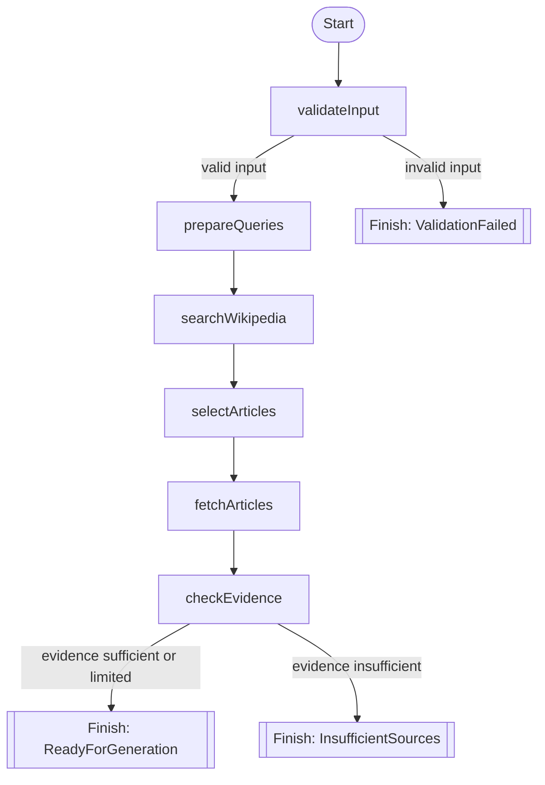

# Study Research Workflow

This document describes the Koog strategy graph implemented in [StudyResearchWorkflow.kt](../shared/src/commonMain/kotlin/org/jetbrains/koog/cyberwave/agent/workflow/StudyResearchWorkflow.kt).

The app uses a deterministic research-first workflow. The graph does not let the model decide whether to skip validation, research, or evidence checks. That is the main point of the design: strategy controls the order.

## Mermaid diagram

## What each node does

### `validateInput`

* validates topics, question count, and optional instructions
* normalizes topic text
* stops the graph immediately if the request is invalid

### `prepareQueries`

* trims and deduplicates normalized topics
* prepares the final list of topics that will be researched

### `searchWikipedia`

* runs Wikipedia search for each prepared topic
* keeps search separate from article fetching so the workflow stays inspectable

### `selectArticles`

* applies deterministic selection rules
* prefers stronger, non-disambiguation results
* limits the article candidates before content fetch begins

### `fetchArticles`

* fetches the selected Wikipedia article content
* reuses fetched articles when multiple topics resolve to the same page

### `checkEvidence`

* evaluates whether the fetched material is strong enough for quiz generation
* computes the effective question count
* finishes with either `ReadyForGeneration` or `InsufficientSources`

## Why this is useful for Koog

This workflow shows the value of custom Koog strategies:

* the graph makes the agent behavior explicit
* validation and research order are enforced by code
* the model is used for structured payload generation, not for controlling the workflow itself
* branch outcomes are visible and testable

## Runtime notes

The workflow is also instrumented with shared tracing hooks. Each major stage emits safe observability events such as:

* stage name
* outcome
* topic counts
* source counts
* duration

The tracing layer intentionally avoids prompts, article bodies, and API keys.
